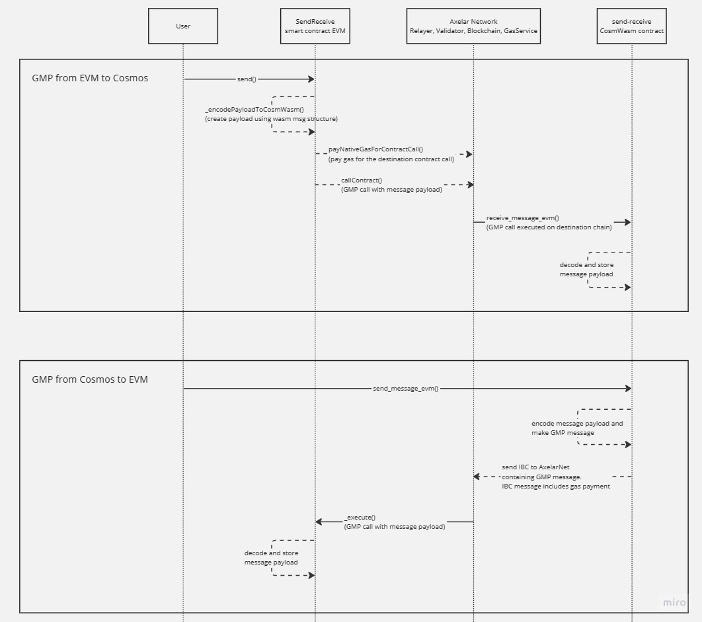

# Axelar GMP sample - passing messages between EVM <> Cosmwasm

This repo demonstrates how to pass arbitrary string messages between EVM and Cosmwasm using Axelar GMP.

## How to use
### Deployments
EVM contract deployed to Fuji Testnet: https://testnet.snowtrace.io/address/0x944bd5Df4bC447f37F52d4CaD89B805DC082aB40#code

Cosmwasm contract deployed to osmosis-5 testnet: `osmo1ejnsp7uk2yrrswrxktav7gdayqc2qmtjh42xlmmzd9965f7exzpqdnm0h8`

Axelar GMP can be tracked on AxelarScan: https://testnet.axelarscan.io/gmp/search

### EVM
Users can call `send("osmosis-6", "osmo1ejnsp7uk2yrrswrxktav7gdayqc2qmtjh42xlmmzd9965f7exzpqdnm0h8", "your_message_here")` to send a message to the Cosmwasm contract. Make sure to include a msg.value to pay for gas, e.g. 0.01 AVAX.

Users can query `storedMessage()` to see the most recently received message payload.

### Cosmwasm
Using osmosisd CLI: https://docs.osmosis.zone/osmosis-core/osmosisd/

Users can send a message from Cosmwasm to EVM using the following command:
```
osmosisd tx wasm execute osmo1ejnsp7uk2yrrswrxktav7gdayqc2qmtjh42xlmmzd9965f7exzpqdnm0h8 '{"send_message_evm": {"destination_chain": "Avalanche", "destination_address":"0x944bd5Df4bC447f37F52d4CaD89B805DC082aB40","message":"YOUR_MESSAGE_HERE"}}' --amount 1uosmo --from wallet --gas-prices 0.1uosmo --gas auto --gas-adjustment 1.3 -y -b block
```
> Note that `--amount 1uosmo` contains the fee paid to the Axelar Gas Service. Currently, Cosmos gas service is still under development so gas is ignored.

Users can query the stored message with the following command:
```
osmosisd query wasm contract-state smart osmo1ejnsp7uk2yrrswrxktav7gdayqc2qmtjh42xlmmzd9965f7exzpqdnm0h8 '{"get_stored_message":"{}"}'
```

## Architecture

